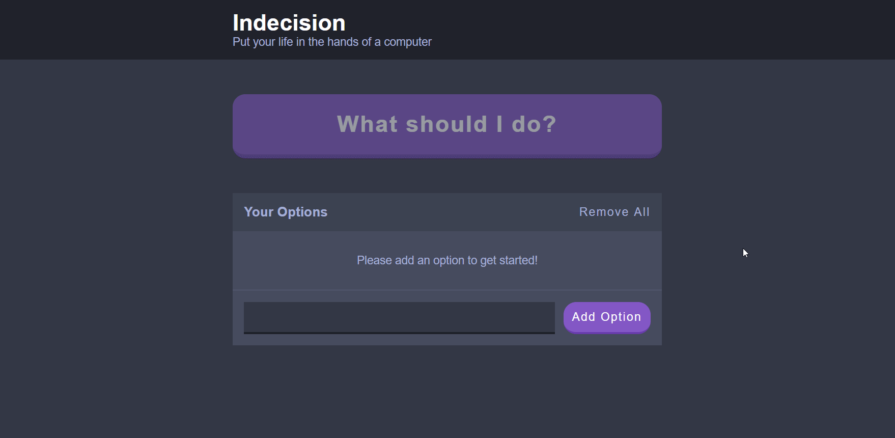

# udemy_Indecision-App
<div align="right">
  
  <a href="https://github.com/Hsins/udemy_Indecision-App/blob/master/LICENSE" alt="License">
    
  </a>
</div>

# Udemy Project: Indecision App

This is a hands-on project from the Udemy course - [The Complete React Developer Course (w/ Hooks and Redux)](https://www.udemy.com/react-2nd-edition/) by Andrew Mead.
  
# Demo

<div align="center">
  
</div>

You can see a complete working example [here](https://hsins.github.io/udemy_Indecision-App/). Or you can run the demo on your local machine, please follow the instructions in [Getting Started](#getting-started).

# Features

- It just is a simple React toy prject.
- Store data with browser's [localStorage](https://developer.mozilla.org/en-US/docs/Web/API/Window/localStorage).
- Use Webpack to bundle JavaScript files.
- Refactor the folder structure.
- Update to using Webpack 4 instead Webpack 3

# Technologies

- [React](https://reactjs.org/)
- [Webpack](https://webpack.js.org/)
- [Babel](https://babeljs.io/)
- SCSS

Check [`package.json`](./package.json) file for more information.

# Getting Started

Follow the instructions below to set up the environment and run this project on your local machine.

1. Clone this repository.

```bash
# Clone repository
$ git clone https://github.com/Hsins/udemy_Indecision-App.git
```

2. Install dependencies via NPM or Yarn

```bash
# Install dependencies via npm
$ npm install

# Install dependencies via yarn
$ yarn install
```

3. Run the server.

```bash
# Build with webpack
$ npm run build

# Run server
$ npm run server
```

Since that [GitHub Pages](https://help.github.com/en/articles/configuring-a-publishing-source-for-github-pages) can only publish site's source files from `master`, `gh-pages` branch, or a `/docs` folder on master branch. I use `git subtree push` command to push the file in `public` file to `gh-pages`:

```bash
$ git subtree push --prefix public origin gh-pages
```

# More Information

All the notes I took in [Markdown](https://daringfireball.net/projects/markdown/syntax) (.md) format. You can find them in my [Udemy-Notes](https://github.com/Hsins/Udemy-Notes) repository. The note for this course is [here](https://hsins.github.io/Udemy-Notes/The%20Complete%20React%20Web%20Developer%20Course%20(with%20Redux)/).

# License

Licensed under the MIT License, Copyright © 2017-present Hsins.
